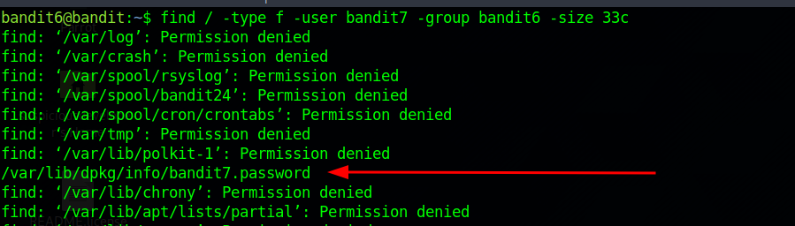

# Bandit\_7

<figure><figcaption></figcaption></figure>

Para ello utilizaremos el siguiente comando find donde buscaremos a través de todos los archivos del sistema con el "/" y además filtraremos por usuario y grupo con las etiquetas -user, -group

<figure><figcaption></figcaption></figure>

Finalmente nos mostrará todo el listado, pero también todos los archivos a los que no ha podido acceder, para arreglar este problema podríamos optar por descartar todas las filas en las que se nos devuelve la información "Permission denied". (Idea: si volcamos este output en un fichero, luego podríamos mostrarlo de forma ordenada, al no tener permisos en esta maquina pues no lo muestro)

<figure><figcaption></figcaption></figure>

Igualmente podríamos encontrar el fichero haciendo scroll:

<figure><figcaption></figcaption></figure>

Si analizamos este ultimo archivo encontraremos un password del siguiente apartado:

<figure><figcaption></figcaption></figure>

password: **z7WtoNQU2XfjmMtA8u5rN4vzqu4v99S**
